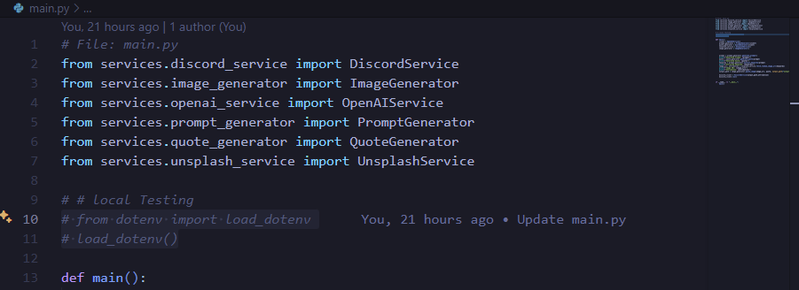

<h1 align="center">Daily Quote Generator</h1>

<p align = "center">
    
</p>

<p align="center"><i>
A simple and customizable daily quote generator that automatically creates and shares inspirational quotes with beautiful backgrounds.  
Easy to set up and modify for anyone who wants their own personalized daily quote bot.
</i></p>

<p align="center">
  
  
  
</p>

<p align="center"><i>Built with the tools and technologies:</i></p>

<p align="center">
  
  
  
  
  
</p>

<hr style="border:3px solid #fff; " />

## 📚 Table of Contents

- [Overview](#overview)
- [Customization](#️-customization)
- [Demo](#demo)
- [Features](#features)
- [Getting Started](#getting-started)
- [Usage](#️usage)
- [How It Works](#how-it-works)
- [Tech Stack](#tech-stack)
- [Contributing](#contributing)
- [License](#license)

## 🧩 Overview

**DailyQuoteGenerator** is a Python-based bot that automatically generates motivational quotes with AI and posts them daily along with a stunning background image.  
It is designed to be customizable, lightweight, and easy to integrate with platforms like Discord or GitHub Actions.

Anyone can fork and personalize it — whether for a personal feed, a community server, or a scheduled post on another platform.


## 🛠️ Customization

Want to tweak it for your own flavor?

You can easily personalize how quotes are generated, styled, and shared by editing the `settings.py` file:

- Change prompt styles and themes
- Customize font size, color, or layout
- Adjust the posting method (Discord or local)
- Set the number of tokens, temperature, and models used

No need to touch the core logic — just update the settings and you're good to go!

To add or remove fonts, simply place or delete font files within the `assets/headerfont` and `assets/contentfont` directories.

## 🎬 Demo

Check out the video demo to see the bot in action:


_This demo shows how the bot generates quotes, selects relevant backgrounds, and posts it to Discord automatically._

## ✨ Features

- 🧠 **AI-Powered Quote Generation**  
  Generates original motivational quotes using OpenAI's GPT models.

- 🖼️ **Stunning Visuals**  
  Fetches relevant, high-quality background images from Unsplash based on the quote theme.

- 🖌️ **Dynamic Image Rendering**  
  Overlays quotes on images with customizable font, size, color, layout, and more.

- 🔁 **Automated Daily Posts**  
  Uses GitHub Actions to schedule and run the bot every day without manual effort.

- 💬 **Discord Integration (Optional)**  
  Easily post your generated quote to any Discord server/channel using a bot token.

- ⚙️ **Fully Configurable**  
  Modify prompt style, keywords, font settings, and scheduling to make it truly yours.

- 🗃️ **Environment-Based Secrets**  
  Keeps your API keys safe and configurable via GitHub secrets or `.env` file.

- 🌐 **Open Source & Forkable**  
  Ready to be customized for personal branding, daily reminders, or community engagement.


<p align="center">
  
  
  
  
  
</p>

## 🛠️ Getting Started

### ✅ Prerequisites

This project requires following dependencies

- **Programming Language:** Python 3.11
- **Package Manager:** Pip
- **API:** OpenAI, Unsplash, Discord

---

### 📦 Installation

1. **Clone the Repository**

    ```bash
    git clone https://github.com/your-username/DailyQuoteGenerator.git
    ```

#### Local Run

2. **Install Dependencies**

    ```bash
    pip install -r requirements.txt
    ```

3. **Set Up Environment Variables**

Create a .env file in the root of the project and add your keys:

    ```
    OPENAI_API_KEY=your_openai_key
    UNSPLASH_ACCESS_KEY=your_unsplash_key
    DISCORD_BOT_TOKEN=your_token
    ```
Enable dotenv in main.py

Make sure this line uncommented near the top of your main.py:



If everything is set up properly, it will generate a daily quote image and optionally post it to Discord.

## ⚙️ Usage

You can generate a quote image and post it to Discord by running:

    ```bash
    python main.py
    ```

#### Github Actions

2. **Set Up Environment Variables**

    Navigate to your forked repository on GitHub.

    Go to Settings > Secrets and Variables > Actions.

    Add the following repository secrets:

    ```
    OPENAI_API_KEY=your_openai_key
    UNSPLASH_ACCESS_KEY=your_unsplash_key
    DISCORD_BOT_TOKEN=your_token
    ```

3. Ensure your workflow file is located at:

    `.github/workflows/daily_quote.yml`
4. The default cron job is set to run daily (you can adjust it as needed):
    ```
    schedule:
    - cron: "30 4 * * *"  # Runs daily at 4:30 AM UTC
    ```
You can also manually trigger the workflow from the Actions tab on GitHub.

## 🧠 How It Works

1. A creative prompt is generated using OpenAI (GPT model).
2. A motivational quote is generated based on that prompt.
3. Relevant keywords are extracted to search for a background image on Unsplash.
4. The image is downloaded and a styled quote is overlaid.
5. The final image is optionally posted to a Discord channel or saved locally.
6. All of this can run daily via GitHub Actions.


## 🛠️ Tech Stack

- **Python 3.11**
- **OpenAI API** – Quote and prompt generation
- **Unsplash API** – Background image search
- **Pillow (PIL)** – Image rendering and text overlay
- **Discord.py** – Posting image to Discord
- **GitHub Actions** – For scheduled daily runs
- **dotenv** – Environment variable management

## 🤝 Contributing

Contributions, ideas, and improvements are always welcome!

To contribute:

1. Fork the repository
2. Create a new branch (`git checkout -b feature/your-feature`)
3. Commit your changes (`git commit -m 'Add some feature'`)
4. Push to the branch (`git push origin feature/your-feature`)
5. Open a Pull Request

Feel free to open issues for suggestions or bugs.

## 📄 License

This project is licensed under the **MIT License**.  
You are free to use, modify, and distribute it as long as you include attribution.

## 🙋‍♂️ Author


<p align="center">
  
</p>

<p align="center">
  <a href="https://github.com/JoelStanly">
    
  </a>
  </p>

<p align="center">
    <a href="https://www.linkedin.com/in/joel-stanly-963505245/">
        
    </a>
</p>


Feel free to connect or reach out on LinkedIn!